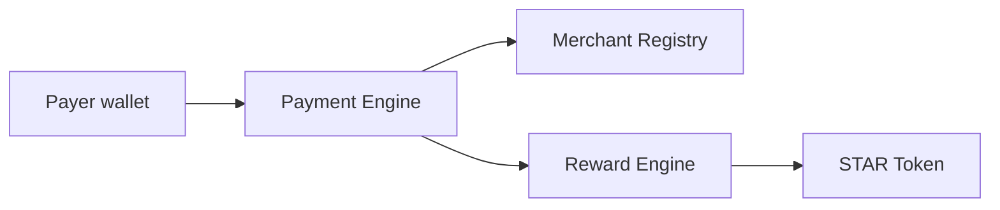

# CryptoPay Network Soroban Contract Architecture

Source of truth: `MASTER_PRD.md` content supplied in the project thread.

## MVP Contract Set

CryptoPay Network MVP has exactly four Soroban contracts:

1. `star-token`
2. `merchant-registry`
3. `reward-engine`
4. `payment-engine`

The contracts intentionally model the MVP simulation layer only. They do not
perform real UPI settlement, banking integration, KYC, bridge execution, or
anchor settlement.

## Contract Responsibilities

### STAR Token

Reward asset for the network.

- SEP-41 style token methods: balances, transfers, allowances, burns, metadata.
- Admin-controlled minting.
- Authorized minters, so the Reward Engine can mint without sharing admin keys.
- Optional max supply guard.
- Pause switch for emergency response.

### Merchant Registry

Canonical on-chain registry for merchants accepted into the MVP.

- Admin-controlled merchant registration.
- Merchant status lifecycle: pending, approved, suspended, rejected.
- Merchant owner authorization for metadata updates.
- Query methods for payment and reward contracts.
- No real KYC integration; stores mock/off-chain reference hashes only.

### Reward Engine

Deterministic reward calculation and idempotent reward issuance.

- Spend reward formula: `10 STAR per INR 100`.
- Referral reward: `100 STAR`.
- Campaign reward records funded by brands.
- Idempotency by reward id.
- Calls STAR token `mint` through a narrow external client interface.
- Pausable by admin.

### Payment Engine

MVP payment simulation ledger.

- Admin-configured Merchant Registry and Reward Engine addresses.
- Payment creation with merchant, payer, asset, INR paise amount, and QR hash.
- State machine: created -> quoted -> converted -> settled -> rewarded -> completed.
- Idempotent payment public id.
- Mock conversion and settlement only.
- Calls Merchant Registry to verify approved merchants.
- Calls Reward Engine to issue spend rewards.

## Trust Model

- Admin keys initialize and configure contracts.
- Merchant owners authorize their own mutable merchant metadata.
- Users authorize payment creation.
- Payment Engine authorizes Reward Engine spend rewards.
- Reward Engine mints STAR through a dedicated minter role on STAR Token.

## Storage Model

All persistent storage uses Soroban instance or persistent storage:

- admin/config/paused values: instance storage
- balances, allowances, merchants, payments, rewards: persistent storage
- idempotency ids: persistent storage

## Failure Strategy

Contracts return typed `#[contracterror]` errors instead of unstructured panics
for business failures:

- unauthorized or uninitialized contract access
- invalid amount or invalid status transition
- duplicate merchant, payment, or reward ids
- missing merchant, payment, or reward records
- supply cap overflow

## Off-Chain Integration Boundaries

The API/database layer remains responsible for:

- QR payload parsing
- crypto price quotes
- mocked UPI receipt rendering
- dashboards and analytics
- real-world integrations in later phases

The contracts record compact, deterministic facts:

- merchant approval state
- payment simulation state
- STAR reward minting
- correlation ids and hashes for off-chain records

## Cross-Contract Calls



## MVP Reward Math

Spend reward:

```txt
floor(amount_in_paise / 10_000) * 10 STAR
```

Examples:

- INR 100 = 10 STAR
- INR 500 = 50 STAR
- INR 1000 = 100 STAR

Referral reward:

```txt
100 STAR
```

## Test Strategy

Each contract has unit tests covering:

- initialization and admin authorization
- duplicate/idempotent record protection
- invalid status transitions
- reward calculation
- token mint/transfer/allowance behavior
- cross-contract payment-to-reward flow
