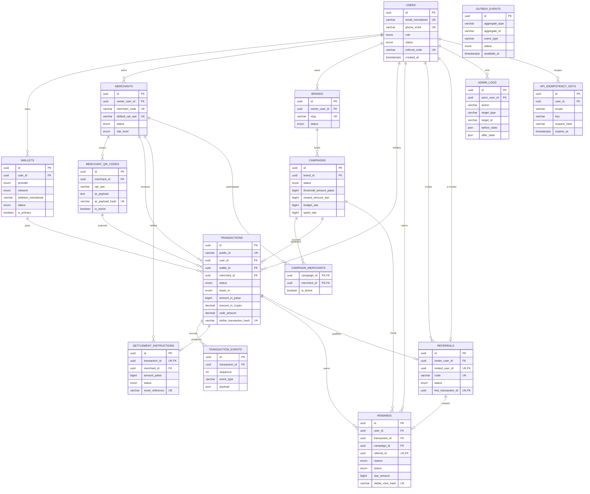

# CryptoPay Network PostgreSQL Architecture

Source: CryptoPay Network Master PRD supplied in the project thread.

The production schema is defined in:

- `apps/api/prisma/schema.prisma`
- `apps/api/prisma/sql/postgres_constraints.sql`

## ERD

## Core Schema Decisions

- Money is stored in integer minor units: INR values use `*_paise` as `BigInt`.
- Crypto and USDC values use `Decimal(36, 18)` to preserve on-chain precision.
- Public transaction references are separate from UUID primary keys through `transactions.public_id`.
- External financial integrations remain mocked through `UPI_MOCK`, mock settlement references, and metadata snapshots.
- Transaction state changes are append-only in `transaction_events`.
- Async side effects use `outbox_events` so payment, reward, and settlement workers can process reliably.
- Write APIs can use `api_idempotency_keys` to prevent duplicate payment creation.

## Prisma-Level Constraints

- Primary keys on every table use UUIDs.
- Natural uniqueness:
  - `users.email_normalized`
  - `users.phone_e164`
  - `users.referral_code`
  - `wallets.network + wallets.address_normalized`
  - `merchants.merchant_code`
  - `merchants.default_upi_vpa`
  - `merchant_qr_codes.qr_payload_hash`
  - `brands.slug`
  - `transactions.public_id`
  - `transactions.stellar_transaction_hash`
  - `settlement_instructions.transaction_id`
  - `settlement_instructions.mock_reference`
  - `rewards.referral_id`
  - `rewards.stellar_mint_hash`
  - `referrals.code`
  - `referrals.invited_user_id`
  - `referrals.first_transaction_id`
  - `api_idempotency_keys.scope + api_idempotency_keys.key`
- Composite identity:
  - `campaign_merchants.campaign_id + merchant_id`
  - `transaction_events.transaction_id + sequence`
- Referential actions:
  - user deletion cascades wallets
  - merchant deletion cascades QR codes and campaign links
  - transaction deletion cascades transaction events and settlement instruction
  - historical financial records use `Restrict` or `SetNull` to avoid accidental loss

## PostgreSQL Hardening Constraints

Defined in `apps/api/prisma/sql/postgres_constraints.sql`:

- one active primary wallet per user
- positive INR, STAR, crypto, USDC, and settlement amounts
- campaign `spent_star <= budget_star`
- non-negative outbox retry attempts
- GIN indexes for JSON metadata/outbox payload search

## Index Strategy

High-cardinality read paths:

- user transaction history: `transactions(user_id, created_at)`
- merchant revenue dashboard: `transactions(merchant_id, created_at)`
- admin transaction monitoring: `transactions(status, created_at)`
- asset/status monitoring: `transactions(asset_in, status)`
- campaign analytics: `transactions(campaign_id, created_at)`
- merchant QR lookup: `merchant_qr_codes(qr_payload_hash)`
- rewards wallet: `rewards(user_id, status, created_at)`
- campaign reward spend: `rewards(campaign_id, created_at)`
- settlement worker queue: `settlement_instructions(status, created_at)`
- outbox worker queue: `outbox_events(status, available_at)`
- admin audit: `admin_logs(target_type, target_id, created_at)`

## Scale Plan

Initial MVP can run on a single PostgreSQL primary with read replicas. For growth:

- partition `transactions`, `transaction_events`, `rewards`, `admin_logs`, and `outbox_events` monthly by `created_at`
- keep indexes local to partitions for high-volume tables
- move analytical dashboards to read replicas or materialized views
- archive old `transaction_events` and `admin_logs` to cold storage after retention windows
- keep idempotency records short-lived with scheduled expiry cleanup
- use transactionally written `outbox_events` instead of direct side effects inside API requests

## PRD Table Coverage

- Users: `users`
- Wallets: `wallets`
- Merchants: `merchants`, `merchant_qr_codes`
- Transactions: `transactions`, `transaction_events`, `settlement_instructions`
- Rewards: `rewards`
- Campaigns: `brands`, `campaigns`, `campaign_merchants`
- Referrals: `referrals`
- AdminLogs: `admin_logs`
